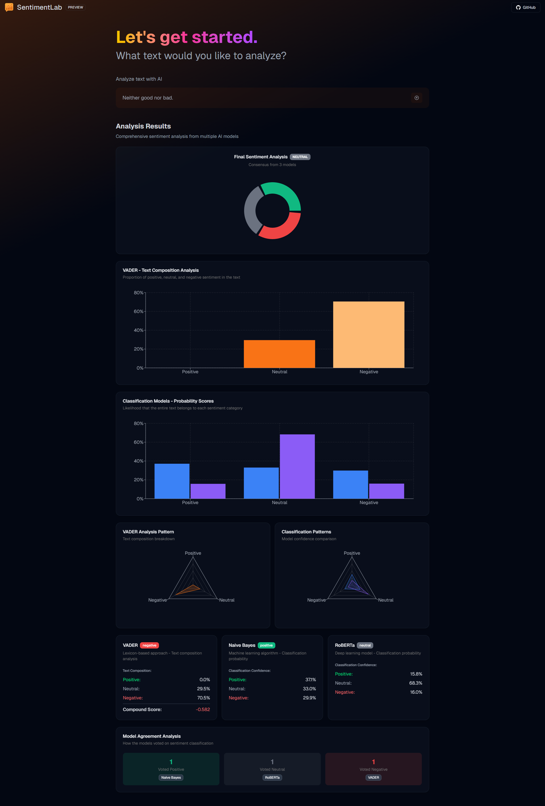

  

# SentimentLab
**SentimentLab** nudi mogućnost analiziranja sentimenta teksta. Pruža 3 modela, a svaki od tih modela predstavlja jedan od 3 pristupa analizi sentimenta. **VADER** predstavlja leksički pristup, **Naivni Bayes** predstavlja strojno učenje (eng. *machine learning*), a **RoBERTa** predstavlja duboko učenje (eng. *deep learning*).

# Stranica

# VADER (Valance Aware Dictionary and sEntiment Reasoner)
**VADER** koristi leksički pristup analizi sentimenta koji se temelji na rječniku riječi i njihovim emocionalnim vrijednostima. Ovaj model je osobito koristan za analizu kratkih tekstova i komentara na društvenim mrežama jer uzima u obzir specifičnosti jezika na mrežama, poput upotrebe skraćenica, interpunkcije i emotikona. VADER koristi unaprijed definirane liste riječi s određenim vrijednostima sentimenta, a zatim kombinira te vrijednosti kako bi odredio ukupni sentiment teksta. Ova vrsta pristupa se zove i bag-of-words. Iako je jednostavan, VADER je vrlo učinkovit za društvene mreže i slične tekstove.

# Naivni Bayes
**Naivni Bayes** je statistički model temeljen na Bayesovom teoremu, koji se često koristi u zadacima klasifikacije teksta, uključujući analizu sentimenta. Ovaj algoritam pretpostavlja da su značajke (riječi u tekstu) međusobno nezavisne, što u praksi nije potpuno točno, ali u mnogim slučajevima daje vrlo dobre rezultate. Prednost Naivnog Bayesa je njegova brzina, jednostavna implementacija i relativno mala potreba za računalnim resursima. Model se trenira tako da izračunava vjerojatnosti pojavljivanja riječi u pozitivnim, negativnim ili neutralnim tekstovima te zatim koristi te vjerojatnosti kako bi klasificirao novi tekst. Iako u usporedbi s modernim neuronskim modelima često pokazuje manju preciznost, Naivni Bayes je i dalje pouzdan izbor za osnovne zadatke analize sentimenta.

# RoBERTa (Robustly optimized BERT approach)
**RoBERTa** je napredni transformer-based jezični model temeljen na BERT-u. RoBERTa optimizira BERT-ov pristup učenja prepoznavanja jezika, čineći ga preciznijim i sposobnijim u analizi sentimenta. Prije svega, RoBERTa je trenirana na puno većoj količini podataka (čak 10 puta većoj). Uz to, RoBERTa za razliku od BERT-a ne koristi next sentence prediction iz razloga što su istraživanja pokazala da s NSP-em ili bez njega nema veće promjene performansi. Također, RoBERTa koristi puno veće batch-eve od BERT-a. Uz to, BERT koristi fiksan postotak (15%) maskiranih tokena u svakom batch-u, dok RoBERTa dinamički mijenja uzorak maskiranja za svaku epohu te tako pomaže modelu da vidi širi raspon maskiranih tokena.

# API pristup i hosting modela
Svaki model u **SentimentLab** projektu dostupan je preko različitih metoda pristupa:

- **VADER**  
Računa se lokalno na serveru putem rute [`/api/analyze.py`](./api/analyze.py), što omogućuje brzu obradu teksta bez potrebe za vanjskim servisima.

- **Naivni Bayes**  
Model je ručno treniran i u potpunosti moj vlastiti rad.  
Pristupa mu se preko API-ja, a hostan je na [**Hugging Face Spaceu**](https://huggingface.co/spaces/maksimilijankatavic/nb-sentiment-classifier), što omogućuje jednostavno integriranje i pozivanje modela putem mreže.

- **RoBERTa**  
Korišten je pretrenirani model visoke točnosti koji se pristupa preko [**Hugging Face Inference API-ja**](https://huggingface.co/cardiffnlp/twitter-roberta-base-sentiment), što omogućuje direktno korištenje moćnog transformer-based modela bez lokalnog treniranja ili hostanja.

# Napomena
Projekt je razvijen kao završni informatički rad na Prirodoslovno-matematičkom fakultetu Sveučilišta u Splitu.